# Jaanch (जाँच) — GeM Bid Compliance Verification Platform
> **Smart India Hackathon 2026** | **Problem ID:** SIH26100 (Ministry of Petroleum & Natural Gas / CPCL)

An automated, AI-powered statutory document compliance verification system designed for the **Government e-Marketplace (GeM)** procurement ecosystem.

---

## 📌 Executive Summary

Public procurement on GeM requires meticulous verification of statutory compliance documents (GSTIN registration, PAN validity, MSME/Udyam certificates, OEM authorization, and non-debarment declarations). Today, tender evaluation committees manually review hundreds of vendor documents per tender, introducing evaluation delays, human oversight risks, and audit vulnerability.

**Jaanch** solves this through a **3-Tier Verification Architecture**:
1. **Tier 1 — Deterministic Verification**: Sub-millisecond mathematical AST checks (Luhn Mod-36 GST checksums, PAN structure, valid state codes).
2. **Tier 2 — Multimodal AI Vision**: Multimodal document extraction & cross-document tampering detection powered by Gemini 1.5.
3. **Tier 3 — External Registry Stubs**: Real-time cross-verification against simulated DigiLocker, GSTN, and MCA registries.

---

## 🏗️ Technical Architecture

```mermaid
flowchart RL
    subgraph S3["3. Rules & Risk Scoring"]
        direction TB
        RULES["⚖️ Deterministic Rules Matrix<br/><code>MET • NOT_MET • NEEDS_REVIEW</code>"]
        SCORE["📊 Scoring & Risk Matrix<br/><code>0–100 Weighted Score • Risk Tiers</code>"]
        DECIDE["👨‍⚖️ Officer Adjudication (HITL)<br/><code>Qualify / Disqualify Verdict</code>"]
        OUTPUT["📋 Verified Bid Compliance Dossier<br/><code>Final Tender Evaluation Report</code>"]

        RULES -->|"Rule Verdicts"| SCORE
        SCORE -->|"Risk Summary"| DECIDE
        DECIDE -->|"Publish"| OUTPUT
    end

    subgraph S4["4. Persistence & Audit Trail"]
        direction TB
        DB[("🗄️ PostgreSQL Database<br/><code>Prisma ORM (TCP Pool)</code>")]
        S3STORE[("☁️ Supabase Object Storage<br/><code>S3 Multipart API</code>")]
        AUDIT["📜 Immutable Audit Trail<br/><code>State Diff & Timestamped Logs</code>"]

        DB <-->|"Store & Query"| AUDIT
    end

    subgraph S2["2. Verification Orchestrator"]
        direction TB
        ORCH["⚙️ Pipeline Orchestrator<br/><code>src/lib/orchestrator.ts</code>"]
        T1["🔍 Tier 1: Deterministic Engine<br/><code>Luhn Mod-36 Checksum • PAN AST</code>"]
        T2["🤖 Tier 2: Multimodal AI Vision<br/><code>HTTPS REST / JSON (Gemini 1.5)</code>"]
        T3["🌐 Tier 3: External Registry Stubs<br/><code>OAuth 2.0 / REST (DigiLocker)</code>"]

        ORCH -->|"In-Memory Calc"| T1
        ORCH -->|"REST API Call"| T2
        ORCH -->|"Bearer Token"| T3
    end

    subgraph S1["1. Client & Gateway Layer"]
        direction TB
        USER["👤 Officer / Bidder Client<br/><code>HTTPS / TLS 1.3 Session</code>"]
        AUTH["🛡️ Session Middleware<br/><code>HMAC-SHA256 Signed Cookie & RBAC</code>"]
        ACTION["⚡ Server Actions Dispatcher<br/><code>HTTP POST (RPC Protocol)</code>"]
        UPLOAD["📦 Multipart Ingestion<br/><code>multipart/form-data (PDF/Image)</code>"]

        USER -->|"POST JSON / Cookies"| AUTH
        AUTH -->|"Authorized Context"| ACTION
        ACTION -->|"Stream Document Bytes"| UPLOAD
    end

    ACTION -->|"Trigger Verification"| ORCH
    UPLOAD -->|"PutObject"| S3STORE
    T1 & T2 & T3 -->|"Normalized JSON"| RULES
    SCORE -->|"Prisma SQL Write"| DB
    SCORE -->|"Log Events"| AUDIT
    DECIDE -->|"Record Decision Log"| AUDIT

    classDef client fill:#eff6ff,stroke:#1d4ed8,stroke-width:1.5px,color:#1e3a8a;
    classDef engine fill:#fefce8,stroke:#ca8a04,stroke-width:1.5px,color:#713f12;
    classDef rules fill:#f0fdf4,stroke:#16a34a,stroke-width:1.5px,color:#14532d;
    classDef store fill:#f5f3ff,stroke:#7c3aed,stroke-width:1.5px,color:#4c1d95;

    class USER,AUTH,ACTION,UPLOAD client;
    class ORCH,T1,T2,T3 engine;
    class RULES,SCORE,DECIDE,OUTPUT rules;
    class DB,S3STORE,AUDIT store;
```



---

## 📂 Repository Structure

```
├── gem-compliance-platform/        # Next.js 14 Full-Stack Application
│   ├── src/
│   │   ├── app/                    # App Router pages (Dashboard, Tenders, OCR, Bidders, etc.)
│   │   ├── components/             # Reusable UI components (GeM Design System)
│   │   └── lib/                    # Verification orchestrator, rules engine & AI adapters
│   ├── prisma/                     # Database schema, migrations, and seed scripts
│   └── public/                     # Static assets, flowchart previews, logos
├── test-documents/                 # Sample test dossiers & synthetic statutory documents
├── demo-evidence/                  # Verification audit logs & demonstration output
├── SIH26100_Problem_Analysis.md    # Full problem statement analysis & technical specification
└── .gitignore                      # Git exclusion rules
```

---

## ⚡ Quickstart & Setup

### Prerequisites
* **Node.js**: v18.17+ or v20+
* **npm**: v9+

### Installation & Run

```bash
# Navigate to the web application directory
cd gem-compliance-platform

# Install dependencies and set up the local database
npm run setup

# Launch the development server
npm run dev
```

Open [http://localhost:3000](http://localhost:3000) in your browser.

---

## 👥 Demo Credentials

| Role | Username | Password | Purpose |
| :--- | :--- | :--- | :--- |
| **Procurement Officer** | `officer` | `Officer@2026` | Full verification adjudication, dossier approval & rule overrides |
| **Audit Desk** | `viewer` | `Viewer@2026` | Read-only compliance inspection & audit log review |

*Or navigate directly to `http://localhost:3000/demo-login` for instant 1-click login.*

---

## 📜 License
Developed for the **Smart India Hackathon 2026**. All rights reserved.
